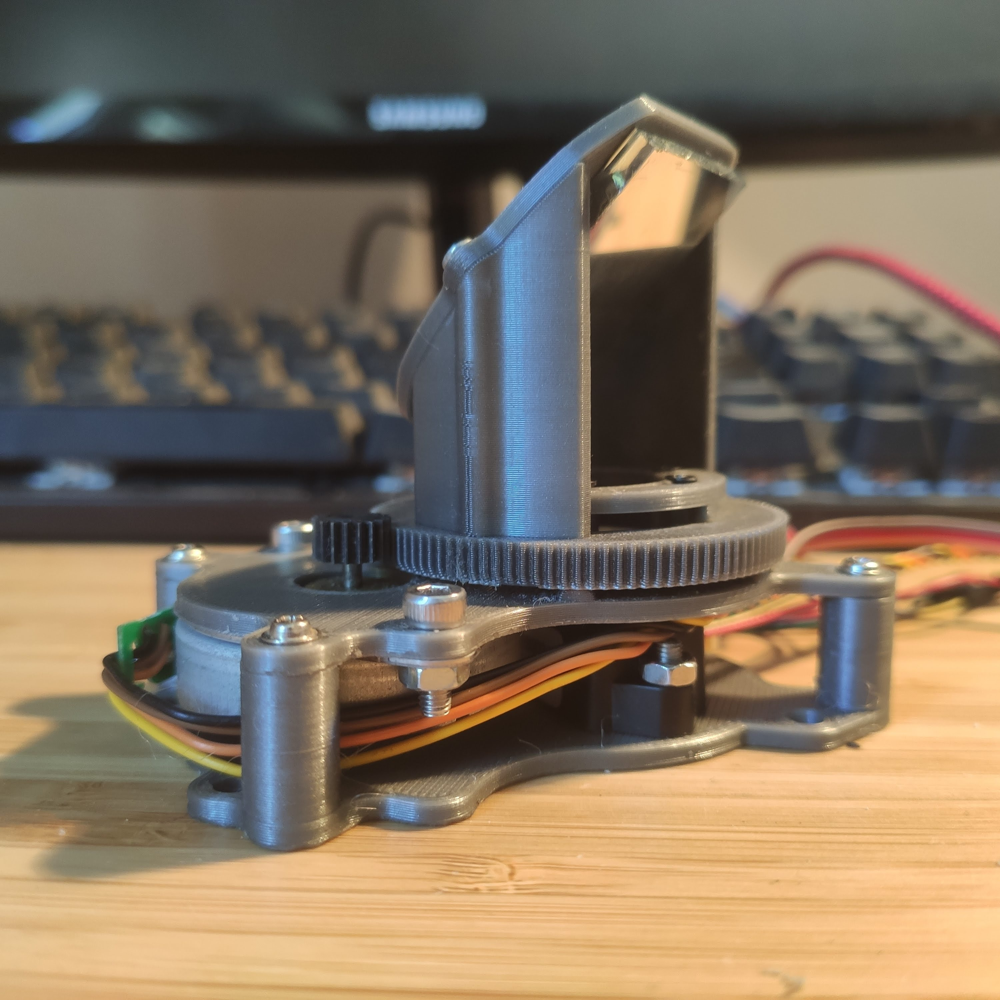
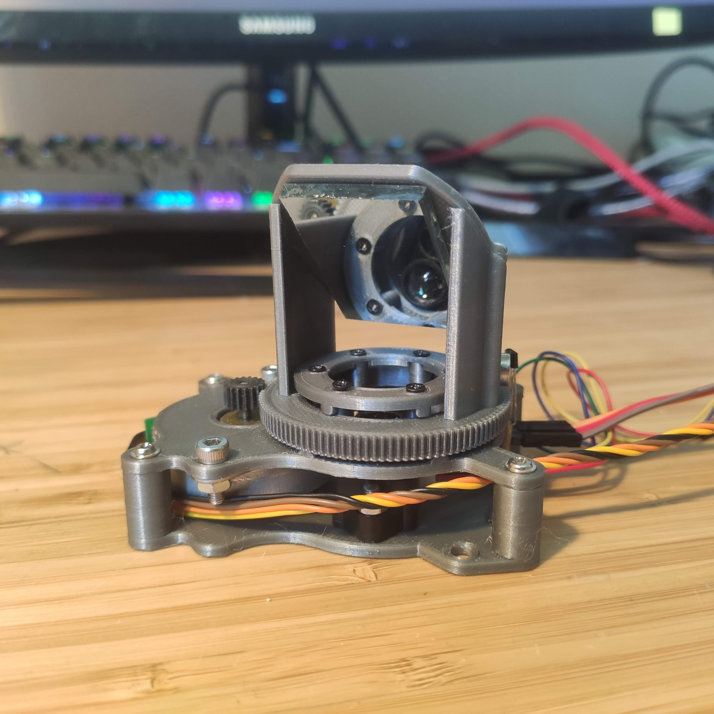
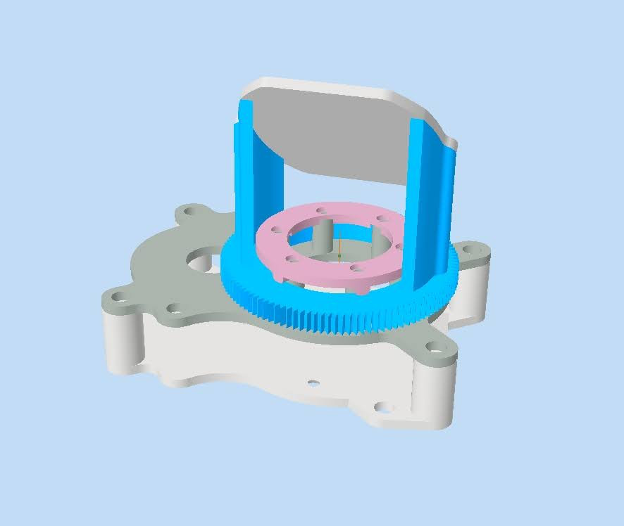
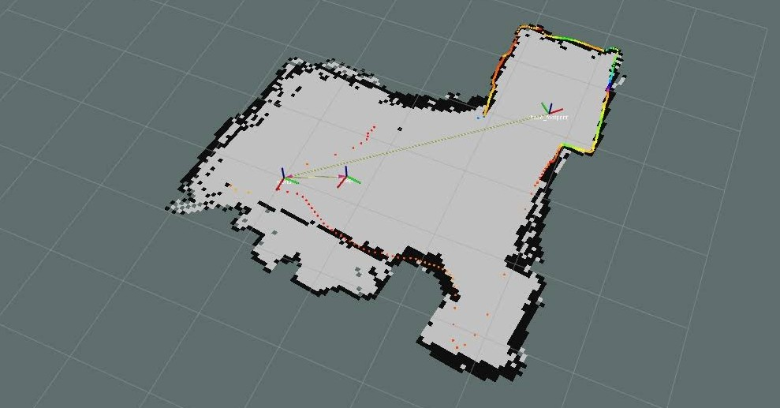

# Custom 3D printed LiDAR

DIY 2D LiDAR I built and programmed from scratch! This repository contains CAD files, code for Arduino and ROS1 node. The arduino board manages the harware (motor, laser sensor and Hal effect sensor) and interfaces it to a computer via USB.

## Pictures

|Views of the LiDAR.|
| -------- |
||
||
|**CAD on Autodesk Inventor.**|
||
|**Map from SLAM performed using the custom LiDAR mounted on a robot.**|
||
